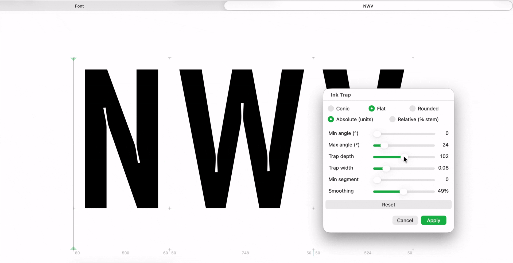
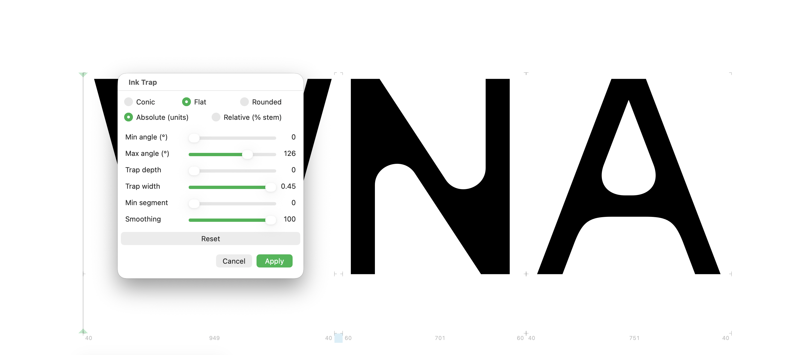
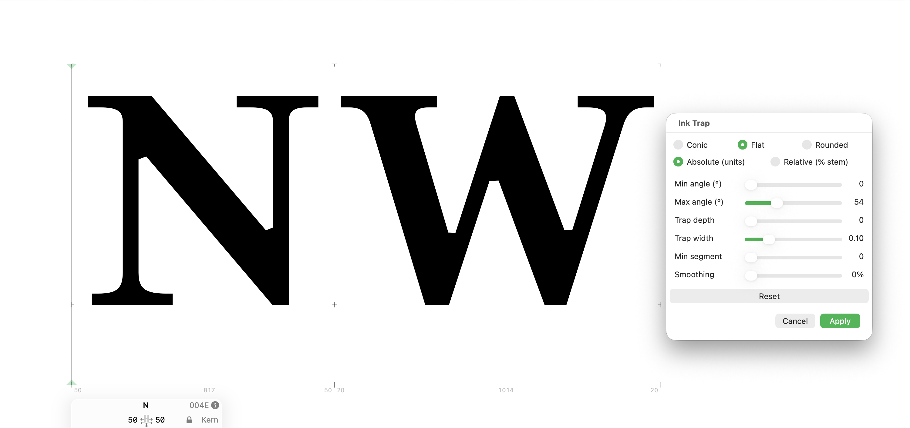
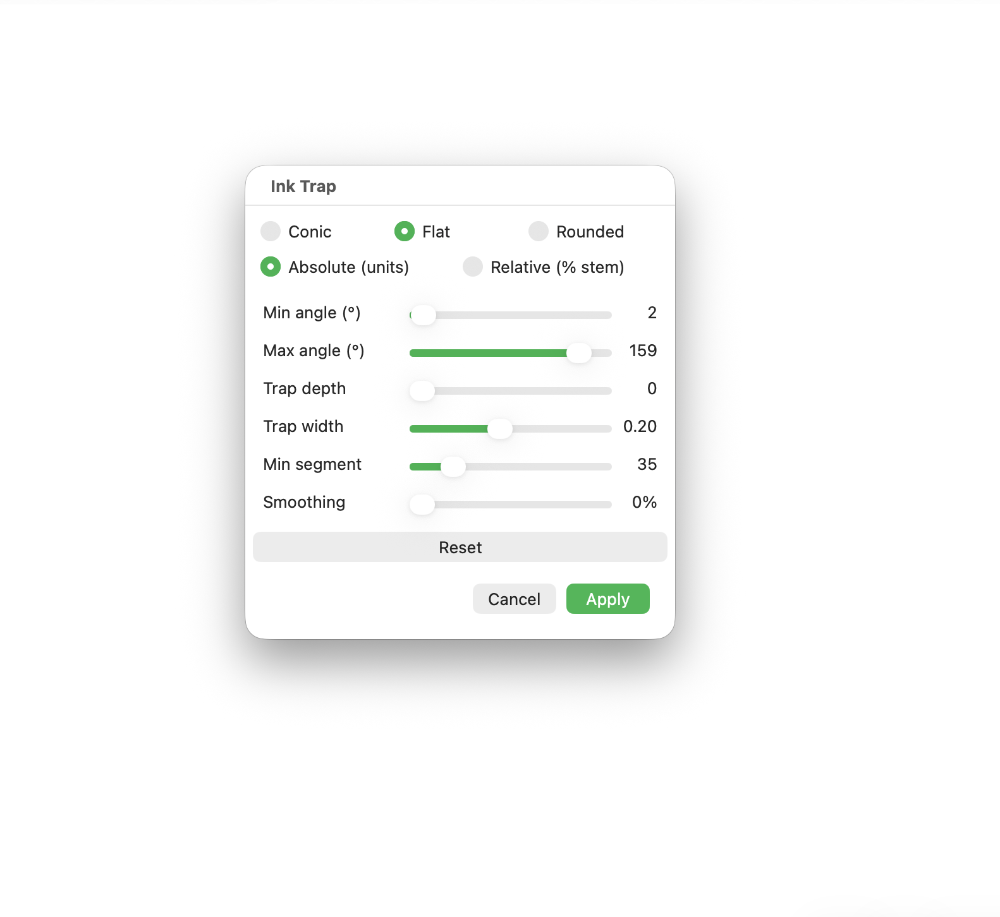
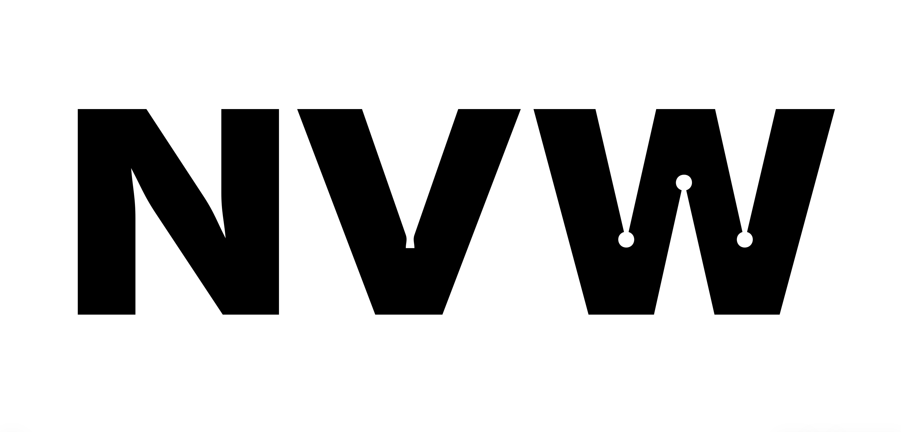

# Ink Trap Generator

**A Glyphs 3 filter plugin that inserts ink traps into the concave joints of any typeface.**

Developed by [Jona Saucedo](https://nonfoundry.com) / Non Foundry.

---

## Overview

Ink Trap Generator finds the concave joints of a glyph — the sharp inner corners where strokes meet, such as the crotches of `M N V W K v w x` — and carves an ink trap into each one. Detection uses the real outline tangents (straight or curved), so it works for both Sans Serif and Serif, including curved-bracket joints. Smooth (tangent-continuous) junctions, like where a bowl meets a stem, are left untouched.

Each trap is built directly on the real segment: on curves the bézier is split exactly with de Casteljau, never approximated on the tangent. Geometry is computed in pure Python (no Cocoa drawing objects) and nodes are rewritten in place, so components are never altered.

---

## Features

- **3 trap shapes** — Conic (V), Flat (straight bottom), Rounded (true circular arc)
- **Automatic chamfer** — a depth of 0 produces a clean straight cut
- **Absolute or relative depth** — fixed units, or a percentage of the master's stem so traps scale with the weight across the whole family
- **Mouth smoothing** — round the junction with the outline, from crisp to soft
- **Thin-stroke guardrail** — depth is capped automatically so a trap never punches through a thin stem
- **Selection-aware** — trap every concave joint, or only the on-curve nodes you select in Edit View
- **Non-destructive to components** — only paths are processed; composites are left intact

---

## Examples

## Sans Serif

## Serif

---

## Requirements

- Glyphs 3.0 or later — compatible with Glyphs 3 and 4
- macOS 11 or later
- The **Vanilla** module (Plugin Manager → Modules)

---

## Usage

1. Select one or more glyphs in the Font View, or open a glyph in Edit View
2. Go to **Filter → Ink Trap**
3. Adjust the parameters in the panel (live preview)
4. Click **Apply**

In Edit View you can select specific on-curve nodes (the joint vertices) before applying to trap only those joints. With nothing selected, every concave joint in the glyph is trapped. Changes are reversible with Cmd-Z, and Cmd-R repeats the last filter.

### Calibration workflow

For consistent results across an entire typeface, calibrate in this order:

1. **Depth mode** — choose Relative (% of stem) for coherent traps across weights, or Absolute for fixed units
2. **Trap depth** — set how deep the trap goes
3. **Trap width** — set the mouth opening
4. **Min / Max angle** — narrow the range of joint openings that get trapped
5. **Smoothing** — soften the mouth if desired
6. Test on a representative set: `M, N, V, W, v, w, K, x` — if these look correct, the rest of the alphabet will follow

> **Rule of thumb:** keep Relative depth so the same setting holds from Thin to Black; only switch to Absolute when fine-tuning a single glyph.

---

## Parameters

| Parameter | Description | Range |
|-----------|-------------|-------|
| Type | Trap shape | Conic, Flat, Rounded |
| Depth mode | How depth is measured | Absolute (u), Relative (% of stem) |
| Min angle | Smallest joint opening to trap | 0 – 180 |
| Max angle | Largest joint opening to trap | 0 – 180 |
| Trap depth | How deep the trap goes (units, or % of stem) | 0 – 200 |
| Trap width | Mouth opening relative to the shorter segment | 0 – 0.45 |
| Min segment | Skips joints with segments shorter than this | 0 – 200 |
| Smoothing | Rounds the junction with the outline | 0 – 100 |

Defaults: Conic · Relative 45% · max angle 100° · width 0.15.

### How Min / Max angle work

*Angle* here means how open a joint is — the angle between the two strokes that meet at a corner:

- **0°** — a spike (the two arms almost parallel)
- **90°** — a right angle
- **180°** — a straight line (no corner)

So a smaller angle is a sharper corner. Min and Max don't set how strong the trap is — they select **which** corners get one. A joint is trapped only when its opening angle falls between Min and Max:

- **Min angle** — the sharpest corner you allow; raising it drops the most pointed joints.
- **Max angle** — the most open corner you allow; lowering it drops the shallow, near-straight joints.

The defaults (0 / 100) trap the sharp and right-angled joints typical of `A V W K N M` and leave gentle, near-straight curves alone. Since each corner has a fixed angle, only the threshold nearest that angle toggles it — which is why moving one slider sometimes changes nothing while the other does.

### How Min segment works

*Min segment* filters corners by the **length of the two strokes that meet at them**, not by their angle. A corner is trapped only when **both** of its arms are at least this long; if either arm is shorter, the corner is skipped.

At the default (0) nothing is filtered. Raising it only starts to bite once the value passes the length of an arm — so on most typefaces, whose trapped joints have long arms, you won't see a change until the slider is fairly high.

Its real use is as a **noise filter**: it keeps traps out of corners built from very short segments — small facets, notches, or fine serif details — where a trap would look cramped. A lowercase `a` shows it well: as you raise Min segment, the traps on the shorter arms drop out before those on the long ones.

---

## UI

---

## Trap shapes
Conic (V) | Flat | Rounded

---

## Multiple masters

Apply the filter per visible master. In **Relative** depth mode the trap depth is taken from that master's stem thickness, so every master gets traps proportional to its own weight — keeping the family visually consistent without re-tuning.

## Known limitations

- On glyphs that mix paths and components, deselect all elements before applying (a known limitation of Python FilterWithDialog plugins).
- Smooth, tangent-continuous junctions are intentionally skipped; only hard concave corners are trapped.
- Applied on the master only; running it as a `Filter` custom parameter at export is not supported.

---

## License

MIT License — © 2026 Jona Saucedo / Non Foundry

See [LICENSE](LICENSE) for full terms.

---

## About

**Non Foundry** is an independent type design studio by Jona Saucedo.

Website: [nonfoundry.com](https://nonfoundry.com)